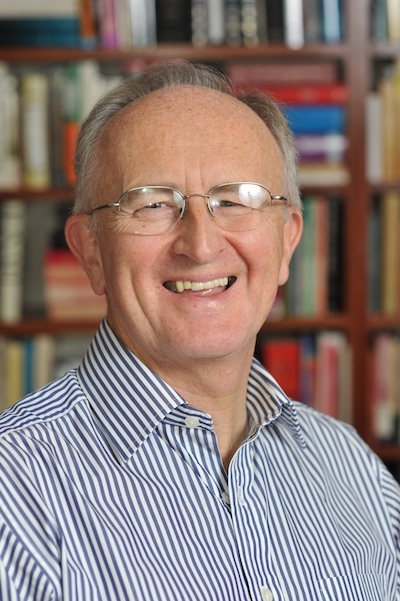

## About Desi Maxwell

Desi grew up in County Antrim, N. Ireland. After studies at the University of Ulster, then Westminster and Princeton theological Seminaries, he served for seven years in pastoral ministry. For the next twenty years he lectured at Belfast Bible College, before seeking to bring the classroom to the living room through 'Xplorations', a teaching ministry emphasising Hebraic roots, which he co-founded and directs with his wife Heather. 